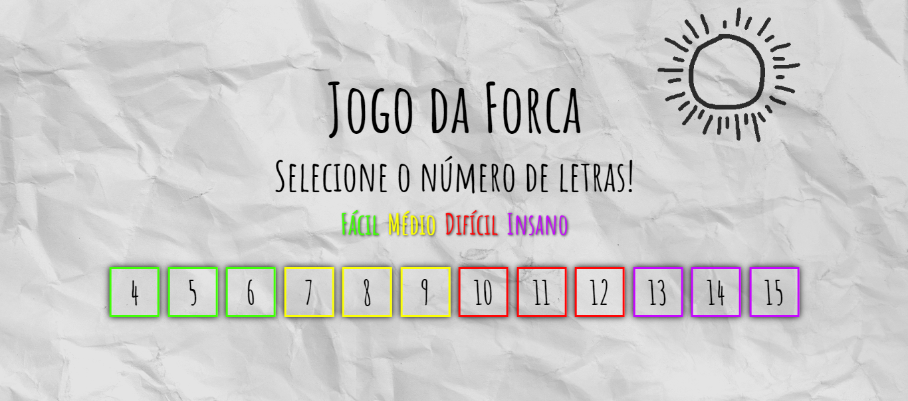

# JOGO DA FORCA EM HTML
☑️JOGO EM HTML/CSS/JS.

 <br> 

## DESCRIÇÃO:
O projeto consiste na recriação do jogo da forca utilizando JavaScript, com todas as animações e sistema feitos por mim. Com 12 níveis disponíveis separados em fácil, médio, difícil, e insano.
(caso tenha jogado em uma versão anterior, clique no sol do menu para resetar e recarregar as palavras novas).

Para jogar, tente acertar a palavra oculta, guiando-se apenas por seu tamanho. Digite uma letra do alfabeto para tentar acertar uma letra, caso esteja acerta ela é escrita no espaço correspondente. Cada nível tem sua própria lista de palavras, que é atualizada após um nível bem sucedido, e também seu limite de erros baseado na dificuldade escolhida. (Acentos e cedilhas são ignorados).

## COMO USAR?
* Clone o repositório para o seu sistema local:

```bash
git clone https://github.com/VILHALVA/JOGO-DA-FORCA-EM-HTML.git
```

* Navegue até o diretório do projeto.

```bash
cd JOGO-DA-FORCA-EM-HTML
```

* Descompacte o arquivo ZIP (se você baixou manualmente):

```bash
unzip JOGO-DA-FORCA-EM-HTML.zip
```
* Abra o arquivo `index.html` em seu navegador de preferência.

## NÃO SABE?
- Entendemos que para manipular arquivos em `HTML`, `CSS` e outras linguagens relacionadas, é necessário possuir conhecimento nessas áreas. Para auxiliar nesse aprendizado, oferecemos cursos gratuitos disponíveis:
* [Curso de HTML e CSS](https://github.com/VILHALVA/CURSO-DE-HTML-E-CSS)
* [Curso de JavaScript](https://github.com/VILHALVA/CURSO-DE-JAVASCRIPT)
* [Confira mais cursos](https://github.com/VILHALVA?tab=repositories&q=+topic:CURSO)

## CREDITOS:
- [PROJETO CRIADO PELO "C836"](https://github.com/C836/Jogo-da-forca)
- [PROJETO EDITADO PELO VILHALVA](https://github.com/VILHALVA)
- [ESTÁ DISPONIVEL NO SITE](https://vilhalva.github.io/STYLER/STYLER.html)